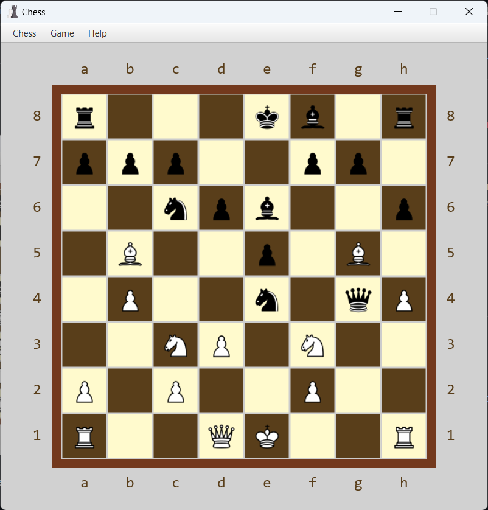

# Chess



Board game for PRG2104 Object-Oriented Programming.

[Source Repository](https://github.com/ChiefWoods/chess)

## Features

- Play against a friend
- Perform special moves such as castling and en passant
- View game stats

## Built With

### Languages

- [](https://www.scala-lang.org/)
- [](https://www.w3.org/Style/CSS/Overview.en.html)


### Libraries

- [ScalaFX](https://www.scalafx.org/)
- [ScalaFXML](https://github.com/vigoo/scalafxml)
- [ScalikeJDBC](http://scalikejdbc.org/)
- [Apache Derby](https://db.apache.org/derby/)

### Tools

- [](https://www.jetbrains.com/idea/)
- [](https://www.jetbrains.com/datagrip/)
- [](https://gluonhq.com/products/scene-builder/)

## Getting Started

### Setup

1. Clone the repository
```
git clone https://github.com/ChiefWoods/chess.git
```

## Issues

View the [open issues](https://github.com/ChiefWoods/chess/issues) for a full list of proposed features and known bugs.

## Acknowledgements

### Resources

- [Shields.io](https://shields.io/)
- [Chess Programming Wiki](https://www.chessprogramming.org/)
- [FreePik](https://www.freepik.com/)
- [Chess.com](https://www.chess.com/)
- [Tourner Dans Le Vide](https://www.youtube.com/watch?v=vtNJMAyeP0s)

## Contact

[chii.yuen@hotmail.com](mailto:chii.yuen@hotmail.com)